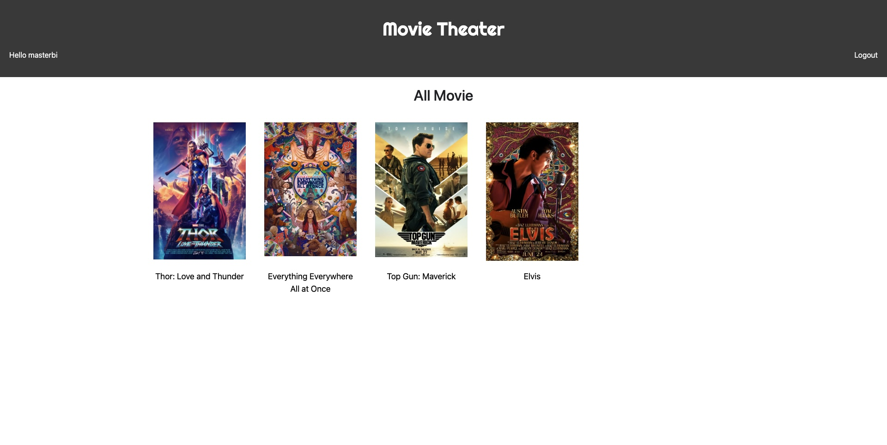
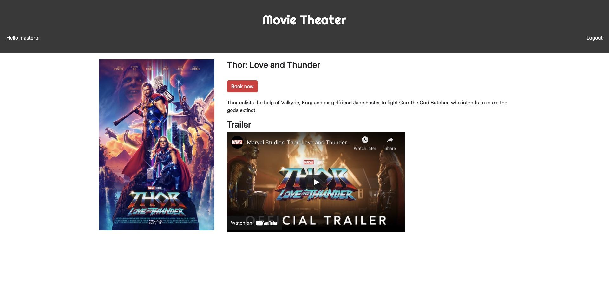
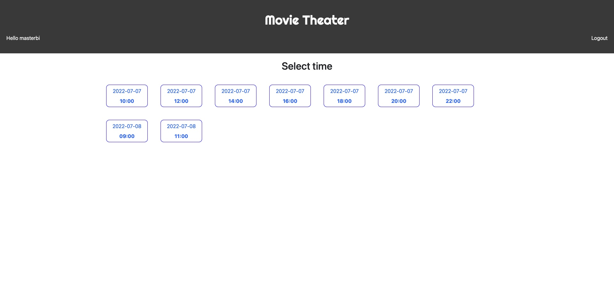
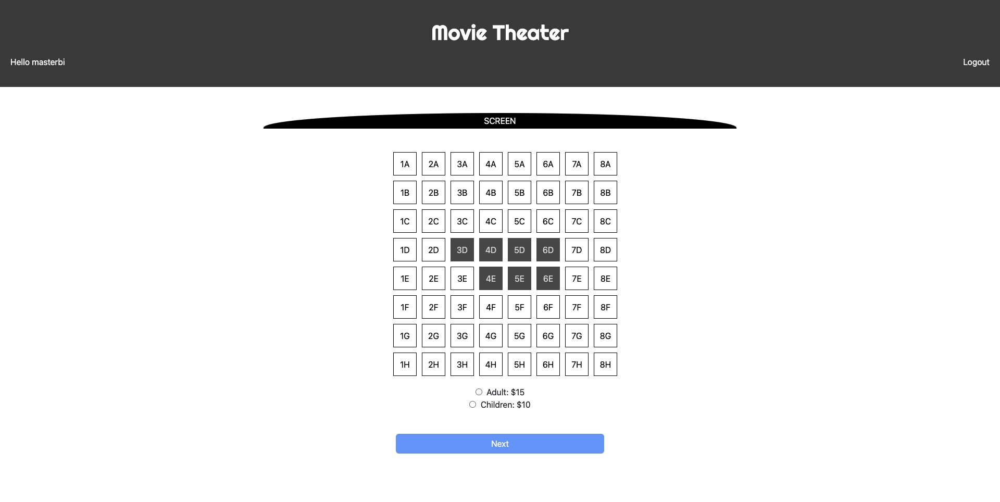
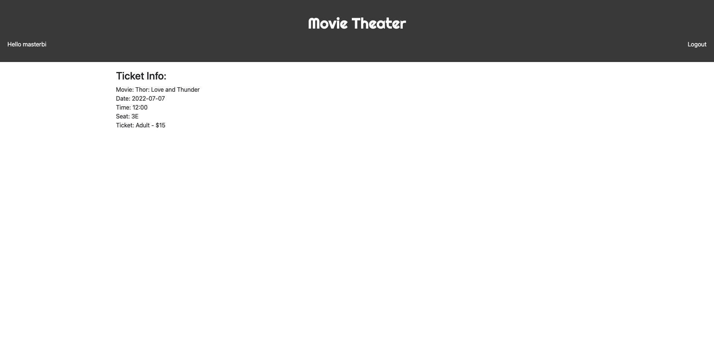
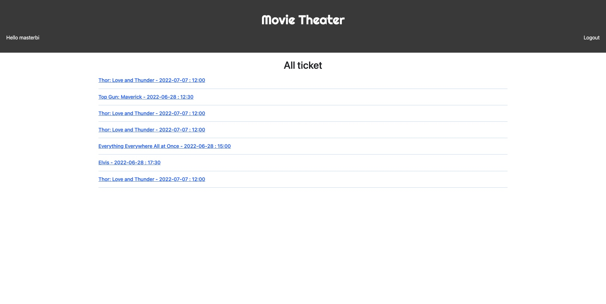
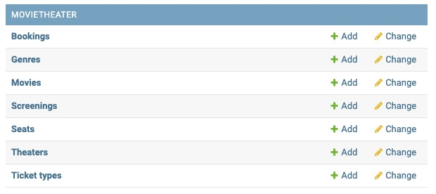

# Final Project (Capstone)

- [Movie Theater](#movie-theater)
    - [Technologies used](#technologies-used)
    - [Project requirements](#project-requirements)
    - [Key features](#key-features)
- [How to run](#how-to-run)
- [API](#api)
- [Source code tree](#source-code-tree)
- [Distinctiveness and Complexity](#distinctiveness-and-complexity)
- [Footnote](#footnote)

## Movie Theater
This project is for the final project [Capstone](https://cs50.harvard.edu/web/2020/projects/final/cap) of the online course [CS50's Web Programming with Python and JavaScript](https://cs50.harvard.edu/web/). The project replicates the basic functions of a movie theater website, where users can register for an account, see which movies is showing, select times, choose a seat, book a ticket for a movie, and see their booking history.
This project uses Django as backend and ReactJS, Javascript (ES6), Bootstrap for frontend.

See live demo here: https://movie-theater-cs50w.herokuapp.com/

### Technologies used:
- Python
- Django:
	- Uses [Django-Rest-Framework](https://www.django-rest-framework.org/) for API manage:
		- Uses `@api_view` decorator to response to API calls
		- Uses `ModelSerializer` to serialize all model query to return results
		- Implement [JWT Authentication](https://jwt.io/) to Django using [Simple JWT](https://django-rest-framework-simplejwt.readthedocs.io/) for [Django-Rest-Framework](https://www.django-rest-framework.org/)
- Javascript (ES6):
    - Uses `Fetch API` for all API calls to communicate with backend.
- ReactJS:
	- Uses ReactJS for frontend UI, only communicates with backend through API calls.
	- Uses `Hash Router` and `useNavigate` from [react-router-dom](http://reactrouter.com/) to routes and navigate through pages.
- Bootstrap:
    - Uses [Bootstrap](https://getbootstrap.com/docs/4.0/getting-started/introduction/) for CSS decoration.


### Project requirements:
- Must be sufficiently distinct from the other projects in this course.
- Utilizes Django (with at lease one model) on the back-end and JavaScript on the front-end.
- All pages are mobile responsive.
- Uses ReactJS for frontend UI, only communicates with backend through API calls.


### Key features:
- ReactJS for frontend UI
- JWT authentication for user
- ##### For user: 
    - Book a ticket for a movie as a user:
        1. Choose a movie
        2. Select screen date and time
        3. Select seat (Cannot choose the seat that has been taken by other user)
        4. Select ticket type
    - View your booked ticket
- ##### For administrator (Utilize Django admin):
    - Add new movie
    - Add new gernes
    - Add screen date and time for a movie
    - Add new theater (Every theater has the same 64 seats for now)
    - Manage ticket type and price for each types
    - Manage movies, genres, screens, seats, theaters, ticket types and bookings by user

## How to run
1. Clone this repo
```
git clone https://github.com/ibretsam/movie-theater.git
```
2. Create a virtual environment and activate it:

```
# Create a virtual environment
python3 -m venv venv

# Activate virtual environment
	# macOS:
	source venv/bin/activate
	# Windows:
	venv/Scripts/activate.bat
```
3. Install required python dependencies:
```
pip install -r requirements.txt
```

4. Navigate into main front-end foldder: 
```
cd front-end/movietheater
``` 

5. Install required Node dependencies:
```
npm install --legacy-peer-deps
```

6. Build React app:
```
npm run build
```
7. Navigate back to main project folder
```
cd ../..
```
8. And finally start the Django web server
```
python manage.py runserver
```
9. Go to the URL provided in the terminal and you should be redirected to the Homepage!

## Usage
When open the index page (`/`), you should be direct to the login page, if you're logged in, you will be direct to the `homepage` (note that you don't have to logged in to go to the `homepage`, but you'll need to logged to use some others function)
In the home page, there're some pre-created movies I've added, you can add more or remove them in the Django Admin panel (To create admin account: `python manage.py createsuperuser`)


You can select any movies, that will redirect you to the `movie page`.


In the `movie page`, you can see some movie informations like the title, the synopsis and the trailer video from youtube.
To book a ticket for this movie, click on `Book now`, you'll be directed to the page where you can select date and time for the movie.


On this page, you can select time to watch the movie based on the schedule that the admin created for this movie.
Choose a time, and you'll be directed to `Select seat page`


On this page, you can see all the taken seat by other users, you cannot choose those seats, you can only choose the available seats (Only choose 1 seat at a time).
After choosing seat, you can choose the ticket types that the admin has added for this movie. 
Click `Next` and you'll be directed to the `ticketInfo Page`


On this page, you can see all the information of your ticket, includes the movie, date, time, seat code and ticket type.

You can see your booking history by click on your username, it'll direct you to the history page.


On this page, you can see all the ticket that you've booked, click on any of that, it'll direct you to the `ticketInfo Page` to see all ticket details

##### Django Admin
Go to the Django Admin panel (`/admin`) and login with you admin account, you can manage some of the model I've registed with Django Admin



## API
API managed by [Django-Rest-Framework](https://www.django-rest-framework.org/)

#### WEBSITE API

###### GET MOVIES:
Returns an array of movies object

	'Endpoint': '/movies/',
	'method': 'GET',
	'body': None

###### GET SINGLE MOVIE:
Returns a single movie object

	'Endpoint': '/movies/id',
	'method': 'GET',
	'body': None

###### GET SCREEN
Returns an array of screen object of the movie object

	'Endpoint': '/movies/id/screen',
	'method': 'GET',
	'body': None

###### GET SINGLE SCREEN
Returns a single screen object

	'Endpoint': '/movies/id/screen/screenId',
	'method': 'GET',
	'body': None

###### GET SINGLE TICKET
Returns a single ticket_type object

	'Endpoint': '/ticket/ticketId',
	'method': 'GET',
	'body': None

###### CREATE SEAT & BOOKING
Create new seat object and new booking object

	'Endpoint': '/movies/id/screen/screenId/book',
	'method': 'POST',
	'headers': {
          "Content-Type": "application/json",
          Authorization: "Bearer " + String,
        }
	'body': {'body': {booking_object}}

###### GET TAKEN SEAT
Returns an array of taken seat of the screen object that related to

	'Endpoint': '/movies/id/screen/screenId/getSeatsInfo',
	'method': 'POST',
	'headers': {
          "Content-Type": "application/json",
          Authorization: "Bearer " + String,
        }
	'body': None

###### GET TICKET TYPES
Returns an array of ticket type of the screen object that related to

	'Endpoint': '/movies/id/screen/screenId/getTicketInfo',
	'method': 'POST',
	'headers': {
          "Content-Type": "application/json",
          Authorization: "Bearer " + String,
        }
	'body': None

###### GET SINGLE BOOKING
Returns a single booking object

	'Endpoint': '/movies/id/screen/screenId/booking/bookingId',
	'method': 'POST',
	'headers': {
          "Content-Type": "application/json",
          Authorization: "Bearer " + String,
        }
	'body': None

###### GET BOOKINGS
Returns an array of booking objects by a specific user

	'Endpoint': '/movies/id/screen/screenId/booking/bookingId/getSeatInfo',
	'method': 'POST',
	'body': None

#### AUTHENTICATION API
Authentication with [Simple JWT](https://django-rest-framework-simplejwt.readthedocs.io/) package for Django

###### REGISTER
Register a user with their username, email, password, confirm password

	'Endpoint': '/auth/register/'
	'method': 'POST'
	'body': {
		'username': String,
		'password': String,
		'confirmation': String, 
		'email': String
	}

###### GET TOKEN (LOGIN)
Return an authentication token if user credentials are correct

	'Endpoint': '/auth/token/'
	'method': 'POST'
	'body': {
		'username': String,
		'password': String
	}

###### GET REFRESH TOKEN
Return a refresh token every 4 minutes

	'Endpoint': '/auth/token/refresh/'
	'method': 'POST'
	'body': {'refresh': String}


## Source code tree
- 📁 `finalProject` - Main project dir
	- 📁 `capstone`
	- 📁 `front-end` - Frontend (ReactJS)
		- 📁 `movietheater`
			- 📁 `build` - React build folder (auto-created)
			- 📁 `node_modules` - Contains all node modules installed via `npm`
			- 📁 `public` - Defaul React files
			- 📁 `src` - Main React folder
				- 📁 `components` - React Components
					- 📄 `Header.js` - Header
					- 📄 `ListMovies.js` - To show all movies in homepage
					- 📄 `ListTicket.js` - To show all ticket types in booking page
					- 📄 `Theater.js` - Default theater page (64 seats)
				- 📁 `context` - React context
					- 📄 `AuthContext.js` - Authentication context (Login, Register, Update refresh token)
				- 📁 `pages` - All pages react components
					- 📄 `BookingPage.js` - For users to choose seat and ticket types
					- 📄 `ConfirmationPage.js` - For users to see their booking info
					- 📄 `LoginPage.js` - For users to login
					- 📄 `MoviePage.js` - Template for single movie page
					- 📄 `MoviesListPage.js` - Listing all movies page
					- 📄 `ProfilePage.js` - For users to see their booking history
					- 📄 `RegistrationPage.js` - For users to register an account
					- 📄 `ScreeningPage.js` - For users to choose date and time of a movie
				- 📁 `utils`
					- 📄 `PrivateRoute.js` - For config private routes (Only logged in users can go to these routes)
				- 📄 `App.css` - Main app CSS files
				- 📄 `App.js` - Main React component
				- 📄 `index.js` - React app entry
			- 📄 `package-lock.json` - React default file
			- 📄 `package.json` - Package manager file
			- 📄 `README.md` - React default file
	- 📁 `movieTheater` - Backend (Django)
		- 📁 `auth` - Authentication files
			- 📄 `serializers.py` - Serializer for authentication models
			- 📄 `urls.py` - Authentication urls
			- 📄 `views.py` - Authentication views
		- 📁 `migration` - Database migration files
		- 📄 `admin.py` - Register models in Django's admin panel.
		- 📄 `apps.py` - App configurations.
		- 📄 `models.py` - App models.
		- 📄 `serializers.py` - Serializers for app models
		- 📄 `tests.py` - App tests
		- 📄 `urls.py` - App urls
		- 📄 `views.py` - App views
	- 📄 `requirement.txt` - Required python dependency

## Distinctiveness and Complexity
For this project, the biggest challenge to me is make the frontend and backend as two seperated apps, the backend using `Django Rest Framework` to manage and response to API calls and the frontend using `ReactJS` for UI. 
This is the first app I've ever built with `ReactJS` so I have to learn a lot about `ReactJS` in order to make the frontend interface for some features like implementing JWT authentication, making the select date, time and choosing seat pages. 
The backend using `Django` has 7 models, utilizes `Django Admin panel` to manage all the model objects and using `Django Rest Framework` to serialize and response to API calls.

## Footnote
I know it's not a "perfect" website for a movie theater, it still lack of a lot of features and you will find it not very convenient to use, I wish I had more time to work on this project, I'd fix a lot of issues the app is having and make it much better, but for the short time I've spent on this project, I've learnt a lot about Django, DRF and React, and I'm proud of my work.
Thank you very much!
